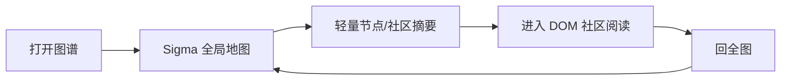

# 图谱体验完整收口设计

日期：2026-06-21
状态：已收敛范围（≤2000 节点）并确认根因，待实现
当前分支：`codex/graph-experience-completion-spec`

## 目的

这份设计用于收口 llm-wiki 图谱当前出现的“两套全图体验”问题。

现在的产品方向已经明确：全局图谱使用 Sigma/Graphology 承担高性能地图视角，社区阅读继续使用 DOM/SVG 承担富信息阅读视角。但当前体验里还残留旧 DOM 全图路径：刚进入图谱是新版 Sigma 全局，进入社区后点击工具栏“回全图”却可能回到旧 DOM 全图，导致样式、点击、社区选择、拖拽、Pin、搜索和抽屉行为割裂。

本设计的目标不是重新做一套 Sigma 全图，也不是把旧 DOM 全图整体搬进 Sigma，而是把已经成熟的全局交互规则统一下来，让 Sigma 全局和 DOM 小图兜底都遵守同一套产品规则。

一句话：

**全局永远是一张地图；正常全局永远回 Sigma；DOM 全图只做小图异常兜底，但规则必须一致。**

## 范围与规模假设

本设计按个人知识库的真实规模收敛，不为超大图过度设计：

- 目标规模：常态 1000 个节点以内，硬上限 2000 个节点。
- 2000 节点以内，Sigma（WebGL）可直接流畅渲染点状全局，无需把节点折叠成聚合块。
- 因此本设计**不包含**节点聚合折叠（“+N 省略号”）、聚合平滑，以及面向超大图的“聚合安全视图”。
- 渲染承载从四种收敛为三种：Sigma 全局、DOM 社区、DOM 小图兜底。
- 仅保留一条极简的超限保护：万一节点数超过上限，给出“图太大，请用筛选”的提示并降级，不卡死、不回旧 DOM 全图，也不为此构建聚合系统。

## 背景依据

本设计延续以下已确认结论：

- `2026-06-18-large-graph-global-community-design.md`：全局图谱负责看结构，社区聚焦负责读内容。
- `2026-06-19-sigma-global-graph-renderer-design.md`：所有正常全局视角统一使用 Sigma/Graphology，DOM/SVG 不再作为用户可选的第二套全局主路径。
- `2026-06-19-sigma-global-production-integration-result.md`：生产路由边界已定义为 `sigma-global`、`dom-svg-community`、`dom-svg-small-fallback` 和 `aggregation-safety-fallback`。
- `2026-06-20-paper-ui-port-design.md`：当前阶段不做图谱画布内部的山水纸面化；图谱画布先跟随项目现有主题。

因此，这次收口不是选型问题，而是把体验、状态和路由规则对齐到已经批准的路线。

## 现状诊断（已复现）

收口前先确认问题真实存在并定位根因，避免在已经正确的代码上返工。

已确认的复现路径：从社区点工具栏“回全图”，会回到旧 DOM/SVG 全图（白色节点卡片、圆形社区计数标记），而不是 Sigma 全局点状地图。

根因（代码级）：

- “进入社区”路由（`dom-svg-community`）默认接到旧 DOM/SVG 渲染管线。
- 这套 DOM 管线自带一套工具条，其“回全图”按钮调用的是管线内部的 `resetViewState()`：它只是把 DOM 视图重新铺满全部节点并在 DOM 里重画，**不会通知 facade 切回 Sigma 全局**。
- 对照之下，Sigma 自身工具条的“回全图”是正确的（留在 Sigma），但那不是用户在社区里点到的那个按钮。

因此根因与“架构边界 / 风险 2”一致：**社区的“回全图”必须上交全局路由切回 Sigma，而不是在 DOM 管线内部自我重置。** 这是本次收口的最小必改项。

## 设计结论

采用“同一套全局规则，三种渲染承载”的方案。

1. 正常全局视角只走 Sigma 全局。
2. 社区视角继续走 DOM/SVG 社区阅读。
3. DOM 全图不再作为正常产品路径，只允许在 Sigma 不可用且图在上限内时作为异常兜底。
4. 节点规模控制在 2000 以内，Sigma 不需要节点聚合；超出上限只做极简降级提示，不回 DOM 全图。
5. 全局交互规则必须从旧 DOM 全图成熟经验里抽出来，成为共享规则；Sigma 全局与 DOM 小图兜底共用同一套规则，不各写一套心智。
6. 社区里所有“回全图”入口都必须回到 Sigma 全局；只有 Sigma 已判定不可用时，才按兜底策略进入 DOM 小图兜底。
7. 全局节点可拖拽保留，并沿用既有“松手即固定 / Pin / 固定位置恢复”能力。

## 第一眼体验

图谱打开的第一页要有“地图感”，不是阅读页，也不是卡片墙。

默认全局视角应呈现：

- 点状节点结构。
- 社区的空间分布和颜色区分。
- 少量关键标签。
- 关系骨架。
- 搜索命中、选中、Pin 和固定位置提示。
- 顶栏、图例、工具栏保持当前项目主题，不做额外山水纸面化。

默认全局视角不出现：

- 节点卡片。
- 大段正文。
- 成片摘要卡。
- 自动展开的社区内容。
- 可见的圆形社区选择按钮。
- 用户可见的“新版 / 旧版全图”切换。

全局图的核心观感是“我在看一张知识地图”，而不是“我在读一组内容卡片”。

## 用户体验规则

### 1. 打开图谱

用户点击“图谱”Tab 后，默认进入 Sigma 全局点状地图。

如果上一次有搜索、选中、Pin、固定节点或所在社区上下文，应尽量恢复这些上下文，但不能因此进入旧 DOM 全图。

### 2. 点击节点

在全局视角点击节点时：

- 保持在全局地图。
- 选中节点。
- 高亮节点和少量直接相关节点。
- 打开轻量节点摘要。
- 不自动进入社区。
- 不自动打开完整阅读内容。

轻量节点摘要里可以提供“进入所属社区”或“打开详情 / 阅读”。只有用户点这些明确动作，才进入 DOM 社区阅读。

### 3. 点击社区

在全局视角点击社区区域、社区标记或社区图例时：

- 保持在全局地图。
- 选中社区。
- 高亮社区和关键跨社区关系。
- 打开轻量社区摘要。
- 不自动进入社区。

轻量社区摘要里的“进入社区”是进入 DOM 社区阅读的明确动作。

社区选择入口只保留一套：

- 背景社区色块是选中社区的主入口。
- 社区图例可以作为列表式辅助入口。
- 不再额外显示圆形社区选择按钮。
- 正常全局视角里，圆形社区按钮和背景色块不能同时存在。

这样用户只需要理解一件事：点地图上的社区区域，就是选中这个社区。

### 4. 进入社区

用户点击“进入社区”后，进入 DOM/SVG 社区阅读视角。

社区视角承担阅读任务：

- 社区内节点完整在场。
- 核心、选中、搜索命中、Pin 和固定节点可以升级为更高信息密度。
- 抽屉可以显示更完整的内容和关系。
- 社区视角可以继续使用 DOM/SVG 的成熟富交互。

这条路径不改成 Sigma。

### 5. 回全图

社区里的所有“回全图”动作必须回到 Sigma 全局。

这包括：

- 社区工具栏里的“回全图”。
- 抽屉里的返回全局动作。
- 任何快捷返回全局的入口。

回全图后：

- 仍是点状 Sigma 全局地图。
- 保留刚才社区的上下文高亮。
- 保留搜索、选中、Pin、固定节点和视口上下文。
- 不跳到旧 DOM 全图。

如果 Sigma 已经失败且不可用，才进入对应兜底路径。

### 6. 搜索和筛选

搜索和筛选只改变高亮、淡化、列表和摘要，不自动重排整张图。

如果当前选中的节点或社区被筛选排除：

- 抽屉保留该对象。
- 提示它当前不在筛选结果中。
- 提供“清除选择”或“显示该对象”的动作。

搜索、筛选、Pin 和固定位置不能互相抢状态。

### 7. 全局拖拽和固定位置

Sigma 全局必须支持节点拖拽。

采用已有成熟规则：

- 用户拖动全局节点时，节点跟随指针移动。
- 松手后该节点自动固定。
- 固定状态等同于用户明确调整过位置，应持久保存。
- 固定节点在搜索、筛选、进入社区、回全局、刷新页面和重启应用后都要尽量保持位置。
- 取消固定必须是明确动作，例如按钮或菜单项，不使用容易误触的双击。

固定位置是一套共享状态，不属于某一个渲染器。

因此：

- Sigma 全局读写同一份固定位置。
- DOM 社区读取同一份固定位置，用于保持用户熟悉的锚点。
- DOM 小图兜底读取同一份固定位置，避免兜底时图突然变成另一张。

### 8. 悬停、缩放和拖动画布

全局视角需要达到旧 DOM 全图的日常可用手感：

- 悬停能提示节点或社区。
- 缩放只调整信息密度，不自动进入社区。
- 拖动画布保持地图连续。
- 交互过程中可以临时隐藏普通标签、弱边和复杂效果。
- 核心锚点、搜索命中、Pin、固定节点和选中对象不能突然消失。

### 9. 社区名字与地图标注

社区名字按“地图地名”处理，不按按钮处理。

默认全局视角：

- 只显示少量重要社区名。
- 社区名贴近对应社区色块的视觉中心或稳定空白位置。
- 社区名是一行轻量标注，过长省略。
- 社区名不放进圆形容器。
- 拥挤时优先隐藏普通社区名，只保留当前选中、悬停、搜索相关或重要社区名。

悬停或选中社区时：

- 对应社区名变清晰。
- 可以显示完整社区名和节点数。
- 背景色块轻微高亮。
- 抽屉显示社区摘要。

社区名的职责是帮助读地图，不是成为第二个社区入口。

### 10. 拥挤降噪

全局拥挤时，靠“缩小点和线、淡化弱边、减少标签”保持点状地图的可读性。2000 节点以内不需要把节点折叠成聚合块。

降噪分三层：

1. 正常密度：显示点、关键线、社区色块和少量社区名。
2. 开始拥挤：缩小普通节点，降低弱边透明度，隐藏普通标签。
3. 明显拥挤：继续缩小普通点，只保留关系骨架；社区名减少到重要、悬停、选中或搜索相关社区。

以下对象不被降噪隐藏，哪怕周围拥挤也要优先露出：

- 当前选中节点。
- 搜索命中节点。
- Pin 节点。
- 用户拖过并固定位置的节点。
- 社区核心节点。

这些对象是用户正在关心的锚点。

### 11. 规模上限与超限保护

正常情况下节点规模在 2000 以内，全局始终是可直接渲染的点状地图。

万一某个知识库节点数超过上限：

- 不卡死，不回旧 DOM 全图。
- 给出明确提示，例如“图较大，请用筛选缩小范围”。
- 引导用户用筛选 / 进入社区 / 搜索来缩小当前可见范围。

不为超限场景构建节点聚合或第二套全图产品。

### 12. 空白点击

点击全局空白区域只清理当前临时选择或关闭浮层。

空白点击不负责：

- 切换新旧全图。
- 进入社区。
- 回全图。
- 重排布局。

## 视图切换的视觉连续性

全局是 Sigma（WebGL 点状），社区是 DOM/SVG（富阅读卡片），两种渲染天生不同。切换时要让用户觉得“我放大 / 缩小了同一张地图”，而不是“跳到了另一个页面”。

心法：全局与社区不是两个视图，而是同一张地图的两个缩放层级。

按重要性分三层处理。

### 1. 节点表现统一

同一个节点在全局和社区必须是“同一个对象的不同详细程度”，不是两种外观：

- 颜色按类型 / 社区决定，全局与社区完全一致。
- 节点的基本形态是“带颜色的点 + 标签”；放大时同一个点展开为卡片，卡片是“点被打开”，不是另一种物件。
- Sigma 高缩放下的卡片与 DOM 社区的卡片共用同一套卡片样式（圆角、阴影、社区色描边一致）。配色与字体已通过共享样式来源统一，重点是统一“点↔卡片”这层表现。

### 2. 位置连续，不瞬移

- 进入社区时，社区视图的初始节点位置以这些节点在全局中的相对位置为起点，再缓动到阅读布局；不丢进全新或随机布局。
- 这一条同时解决“固定位置在社区如何使用”：固定 / 全局坐标作为进场起点，再过渡到阅读布局，二者不冲突。
- 进入社区表现为“镜头推进”：Sigma 先朝目标社区色块聚拢、其余淡出，再把社区视图淡入到该色块刚才的位置与大小；回全图反向。
- 用户刚点击 / 选中的节点，在切换前后保持位置不跳变、外观一致。

### 3. 切换是渐变，不是硬切

- 两套渲染器交替时使用约 200–300ms 的交叉淡入淡出，并对齐缩放与中心，让它像“一张图变清晰”，而不是“两张图对调”。
- 外壳（工具条、右抽屉、背景）在切换前后保持一致，不在两条路由间换皮。

分阶段：先做便宜且收益最大的部分——共享卡片样式、社区色、统一外壳、进场用全局位置、交叉淡入淡出、选中节点不跳变。逐节点跨渲染器的位移动画（每个节点从全局坐标滑到社区坐标）工作量大、收益递减，先不做，必要时再加。

不为消除接缝而把社区改成 Sigma：社区是精读场景，DOM 的富文本卡片与抽屉天然优于 WebGL。两套渲染器是合理分工，接缝靠上面三层弥合。

## 架构边界

### 不直接“搬 DOM 到 Sigma”

把旧 DOM 全图的代码直接迁移到 Sigma 不是最优解。

原因是旧 DOM 全图里混合了两类东西：

- 成熟的产品规则，例如点击节点、点击社区、Pin、固定位置、抽屉、搜索高亮。
- DOM/SVG 特有的绘制方式，例如元素结构、样式、事件绑定和布局细节。

真正应该保留的是第一类产品规则，而不是第二类绘制实现。

因此，正确做法是：

**抽出旧 DOM 全图已经验证过的交互语义，让 Sigma 全局实现这些语义。**

这样后续如果渲染器变化，用户心智不变。

### 规则层

全局规则层负责回答：

- 点到节点应该发生什么。
- 点到社区应该发生什么。
- 搜索命中如何影响图面和抽屉。
- Pin 与固定位置如何表现。
- 进入社区和回全图如何切换。
- 当前对象被筛掉时如何提示。
- 兜底时哪些能力必须保留。

规则层不负责画图。

### Sigma 全局

Sigma 全局负责正常全局地图：

- 画点、边、社区和关键标签。
- 承接缩放、平移、悬停、节点点击、社区命中和节点拖拽。
- 把用户点到或拖到的对象交给全局规则层处理。
- 展示规则层给出的选中、高亮、Pin、固定和摘要状态。

Sigma 不保存另一份业务状态，也不自行决定抽屉内容。

### DOM 社区

DOM 社区负责社区阅读：

- 完整展示社区节点。
- 承担内容阅读、节点详情和更高密度交互。
- 使用同一份选中、搜索、Pin 和固定位置状态。
- “回全图”动作交还给全局路由，而不是在 DOM 内部自己回旧全图。

### DOM 小图兜底

DOM 小图兜底只在 Sigma 不可用且图规模较小时出现。

它必须遵守与 Sigma 全局相同的规则：

- 点击节点打开轻量节点摘要。
- 点击社区打开轻量社区摘要。
- 进入社区走 DOM 社区。
- 回全图仍由全局路由判断。
- 搜索、筛选、Pin、固定位置和抽屉规则一致。

用户不应该感觉兜底后换了一套产品。

### 超限降级提示

不再设“聚合安全视图”。节点规模控制在 2000 以内，正常不会触发超大图。

唯一的超限保护是一条静态降级提示：

- 不卡死，不回旧 DOM 全图。
- 告诉用户图较大，引导用筛选 / 搜索 / 进入社区缩小范围。
- 提供清除选择、重试等基本动作。

它不是第二套全图产品，也不构建节点聚合。

### Sigma 可用性判定

“Sigma 是否可用”是一次性的全局判定结果，由全局统一判断并广播，各视图共享同一结论：

- 判定为不可用的条件：Sigma 初始化失败，或运行期发生不可恢复错误（例如 WebGL 上下文缺失 / 丢失）。
- 判定为不可用后，图在上限内走 DOM 小图兜底。
- “回全图”只有在已判定 Sigma 不可用时才进入兜底，否则一律回 Sigma 全局。
- 超限降级是独立的另一条保护：只要节点数超过上限就触发，与 Sigma 是否可用无关。

## 状态同步规则

先区分两个“统一”：**交互规则**由全局承载（Sigma 全局、DOM 小图兜底）共用；**以下状态**由全部视图（含 DOM 社区）共用。

以下状态必须在 Sigma 全局、DOM 社区、DOM 小图兜底之间共享：

- 当前知识库。
- 当前视图路由。
- 当前选中节点或社区。
- 当前搜索词和搜索命中。
- 当前筛选条件。
- Pin 节点。
- 固定节点位置。
- 当前社区上下文。
- 右侧抽屉对象。
- Sigma 是否可用的判定结果。

尤其要注意固定位置：

- 固定位置不是 Sigma 私有状态。
- 固定位置不是 DOM 私有状态。
- 固定位置是用户对知识地图的编辑结果。

只要用户拖过节点，后续各视图都应该尊重这次调整。

## 兜底规则

兜底不再按“旧版全图”理解，而按“同规则的异常承载”理解。

正常情况：

Sigma 不可用：

节点超过上限（极少发生）：

兜底状态下可以降低视觉和性能要求，但不能换掉交互心智。

## 明确不做

本次收口不包含：

- 把社区阅读改成 Sigma。
- 把全局改成卡片化视图。
- 保留正常全局里的圆形社区选择按钮。
- 新增山水纸面感图谱视觉。
- 增加用户可见的新旧全图切换。
- 重做关系数据生产。
- 新增路径解释、导出图片、图谱 lint 等额外能力。
- 把大图异常回退到旧 DOM 全图硬撑。
- 用双击空白这类隐式动作承担取消固定或切换视图。
- 节点聚合折叠（“+N 省略号”）与聚合平滑。
- 面向超大图的聚合安全视图（改为极简超限提示）。
- 逐节点跨渲染器的位移动画（先做淡入淡出即可）。

## 验收标准

实现完成后，至少需要满足以下可观察结果：

1. 打开“图谱”Tab，第一眼是 Sigma 点状全局地图，不是 DOM 全图，不是卡片墙。
2. 全局点击节点，停留在全局，打开轻量节点摘要。
3. 全局点击社区，停留在全局，打开轻量社区摘要。
4. 点击“进入社区”，进入 DOM 社区阅读。
5. 在社区点击工具栏“回全图”，回到 Sigma 全局，不回旧 DOM 全图。
6. 从抽屉或其他入口回全图，也回到 Sigma 全局。
7. Sigma 全局可以拖动节点，松手后节点固定。
8. 刷新页面后，固定节点位置仍恢复。
9. 进入社区再回全局，固定节点位置仍恢复。
10. 搜索、筛选、选中、Pin 和固定位置在全局与社区之间不丢失。
11. Sigma 不可用时，DOM 小图兜底仍遵守同一套全局规则，不进入旧 DOM 全图。
12. 节点超过上限时只显示超限降级提示，不卡死、不进入旧 DOM 全图、不出现节点聚合。
13. 全局视角不出现节点卡片。
14. 正常全局视角不出现圆形社区选择按钮；背景社区色块是地图上的社区选择入口。
15. 社区名以地图地名方式显示，不塞进圆形按钮。
16. 拥挤时缩小普通节点、淡化弱边、减少标签；不出现节点聚合折叠。
17. 社区里的“回全图”上交全局路由切回 Sigma；代码层不存在第二条用户正常可达的 DOM 全图入口。
18. 切换全局↔社区时，被选中节点颜色 / 标签一致、位置不跳变；切换为淡入淡出而非硬切；社区进场以全局相对位置为起点。
19. 用户看不到“旧版 / 新版全图”这样的模式分叉。

## 风险与处理原则

### 风险 1：拖拽固定位置牵涉多视图状态

处理原则：固定位置是用户成果，必须做成共享状态。不要让 Sigma、DOM 社区和 DOM 兜底各自保存位置。

### 风险 2：DOM 社区内部仍有自己的回全图逻辑

已确认为本次根因（见“现状诊断”）：社区工具条的“回全图”调用 DOM 管线内部的 `resetViewState()`，没有切回 Sigma。

处理原则：社区里的回全图动作必须上交全局路由，不允许 DOM 社区自行切回旧 DOM 全图。

### 风险 3：兜底体验再次分叉

处理原则：DOM 小图兜底不是旧产品复活。它必须调用同一套全局规则，只换渲染承载。

### 风险 4：全局地图被做成阅读界面

处理原则：全局只看结构。阅读、详情和高密度内容留给社区视角和右侧抽屉。

### 风险 5：两套渲染器在切换处视觉割裂

处理原则：把全局与社区当作同一张地图的两个缩放层级——统一节点表现（点↔卡片同源）、保持位置连续、用淡入淡出替代硬切。详见“视图切换的视觉连续性”。

## 后续交接边界

后续如果进入实现计划，应只围绕以下交付边界展开，不扩大到图谱新功能：

- 统一全局返回路径（社区“回全图”上交全局路由切回 Sigma，替换 DOM 管线内部的 `resetViewState` 自我重置）。
- 统一全局交互规则。
- 补齐 Sigma 全局日常交互。
- 沿用全局节点拖拽和固定位置能力。
- 移除正常全局里的圆形社区按钮，改为社区色块 + 地图地名。
- 接入拥挤降噪规则：缩点、淡边、减标签，不做节点聚合。
- 实现全局↔社区切换的视觉连续性（节点表现统一、位置连续、淡入淡出）。
- 同步 DOM 小图兜底规则。
- 节点超过上限时显示超限降级提示。
- 按本文验收标准逐项验证。

这份文档只定义设计和验收，不直接进入实现。

## 修订记录

- 2026-06-21（二版）：按 ≤2000 节点收敛——删除节点聚合、聚合平滑与聚合安全视图，渲染承载收敛为三种；补“现状诊断”确认根因（社区回全图调用 DOM 管线 `resetViewState`，未切回 Sigma）；新增“视图切换的视觉连续性”；补 Sigma 可用性判定与相关验收项。
